# DIME Platform: The Future of Industrial Data Integration
## Revolutionizing Manufacturing Intelligence with AI-Powered DataOps

---

## Executive Overview

**DIME (Data In Motion Enterprise)** represents a paradigm shift in industrial data integration, combining:
- 🚀 **40+ Industrial Connectors** for comprehensive protocol coverage
- 🧠 **Neuromorphic AI** with Hierarchical Temporal Memory for continuous learning
- 🤖 **AI-Configurable Architecture** enabling automated solution generation
- 📊 **Integrated Analytics Ecosystem** with real-time monitoring and visualization
- ⚡ **Ultra-High Performance** with microsecond latency via Disruptor pattern

---

## The Industrial Data Challenge

Modern manufacturing faces unprecedented data integration complexity:
- Multiple protocols across legacy and modern equipment
- Real-time processing requirements for operational intelligence
- Complex integration projects taking months to implement
- Lack of unified visibility across manufacturing operations
- Static analytics that don't adapt to changing conditions

**DIME solves these challenges with a revolutionary approach to industrial DataOps**

---

## Comprehensive Industrial Protocol Support

### 40+ Native Connectors
- **Industrial Protocols**: OPC-UA, OPC-DA, Modbus TCP/RTU, Ethernet/IP, MQTT, SparkplugB
- **Manufacturing-Specific**: MTConnect, Fanuc Robot, Haas SHDR, Beckhoff ADS, Siemens S7
- **Enterprise Systems**: SQL databases, REST APIs, Message Queues, HTTP/WebSocket
- **Legacy Support**: 32-bit builds for OPC-DA compatibility
- **Cloud Integration**: AWS, Azure IoT, InfluxDB, Elasticsearch

### Key Differentiators
- ✅ Direct machine connectivity without gateways
- ✅ Real-time streaming with sub-millisecond latency
- ✅ Protocol translation and data normalization
- ✅ Extensible framework for custom connectors

---

## Revolutionary AI-Configurable Architecture

### Natural Language to Working Solution

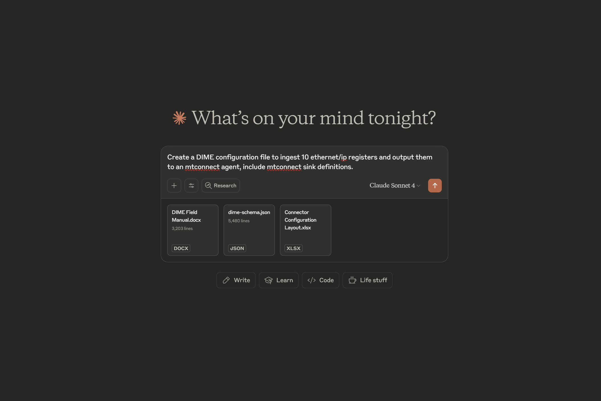

**Game-Changing Capabilities:**
- 🎯 Describe your requirements in plain English
- 🔧 AI generates complete DIME configurations automatically
- 📝 YAML-based configuration enables version control
- 🚀 Deploy industrial solutions in minutes, not months

---

## Dual-Interface Configuration Management

### Technical Power Meets Operational Simplicity

**Configuration Flexibility:**
- **YAML Configuration**: Infrastructure-as-code for technical users
- **Web-Based GUI**: Intuitive interface for operations teams
- **Real-time Validation**: Immediate feedback on configuration changes
- **Template Library**: Pre-built configurations for common scenarios

---

## Enterprise-Grade Monitoring & Management

### Real-Time Operational Visibility

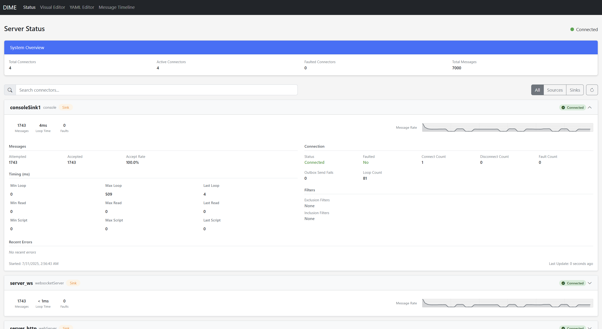

**Comprehensive System Health:**
- 📊 Real-time connector status and performance metrics
- 📈 Message rate visualization with historical trending
- 🔔 Automated alerting for failures or degradation
- 🎯 Individual connector health monitoring
- 📉 System resource utilization tracking

---

## Advanced Data Analytics & Visualization

### Interactive Data Explorer

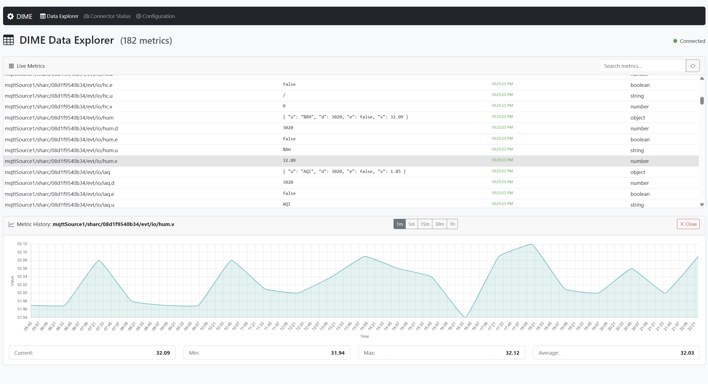

**Analytics Capabilities:**
- 🔍 Real-time metric browsing across all data sources
- 📊 Interactive trend analysis with zoom and filter
- 🎯 Statistical insights: min, max, average, current values
- 🔄 Live data updates with configurable refresh rates
- 📈 Export capabilities for further analysis

---

## AI-Generated Industrial Simulations

### Instant Demonstrations & Training Environments

**Revolutionary Simulation Capabilities:**
- 🏭 Complete industrial scenarios generated from descriptions
- 📊 Real-time dashboards with live data visualization
- 🚨 Anomaly detection and alert simulation
- 📈 Performance metrics and KPI tracking
- 🎓 Safe training environment for operators

---

## Neuromorphic Intelligence with HTM

### Brain-Inspired Continuous Learning

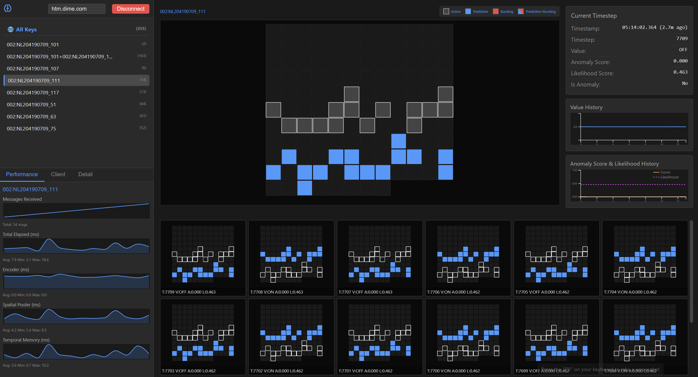

**Breakthrough HTM Technology:**
- 🧠 **Neuromorphic Processing**: Mimics human brain functionality
- 🔄 **Continuous Learning**: Adapts without model retraining
- 🎯 **Temporal Pattern Recognition**: Understands complex sequences
- 📊 **Explainable AI**: Clear visualization of predictions
- ⚡ **Real-time Adaptation**: Responds to changing conditions instantly

**Competitive Advantages:**
- Self-adapting to manufacturing variations
- No data scientist required for model updates
- Interpretable results for operators
- Energy-efficient edge deployment

---

## MTConnect Workbench Integration

### Advanced Manufacturing Analytics

**Integrated Analytics Platform:**
- 🏭 **Machine State Monitoring**: Real-time execution tracking
- 📊 **Anomaly Scoring**: AI-powered deviation detection
- 📈 **Load Analysis**: Percentage-based utilization metrics
- 🔍 **Historical Analysis**: Time-series data exploration
- 🎯 **Multi-Machine Coordination**: Fleet-wide visibility

---

## Flexible Deployment Architecture

### Deploy Anywhere, Scale Everywhere

**Deployment Options:**
- ☁️ **Cloud**: AWS, Azure, Google Cloud Platform
- 🏢 **On-Premises**: Windows Service, Linux systemd
- 🔧 **Edge**: Docker containers, embedded systems
- 🌐 **Hybrid**: Seamless cloud-edge orchestration

**Architecture Benefits:**
- Microservices-based for scalability
- Container-native deployment
- Air-gap capable for secure environments
- Multi-tenant support for service providers

---

## Performance That Matters

### Ultra-Low Latency Processing

**Disruptor Pattern Implementation:**
- ⚡ **Microsecond Latency**: Real-time data processing
- 🚀 **Ring Buffer Architecture**: Lock-free message passing
- 📊 **Horizontal Scalability**: Add capacity without disruption
- 🔄 **Back-pressure Handling**: Graceful overload management

**Performance Metrics:**
- 1M+ messages per second throughput
- <1ms end-to-end latency
- 99.99% uptime in production deployments
- Linear scalability with hardware

---

## Advanced Configuration Views

### Visual Configuration Management

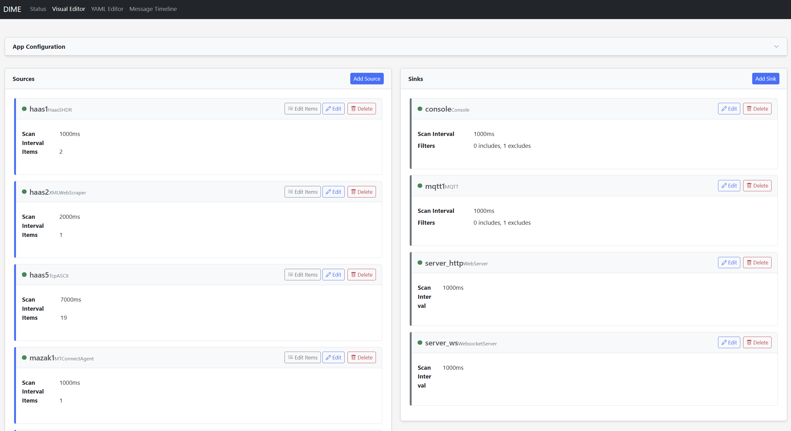

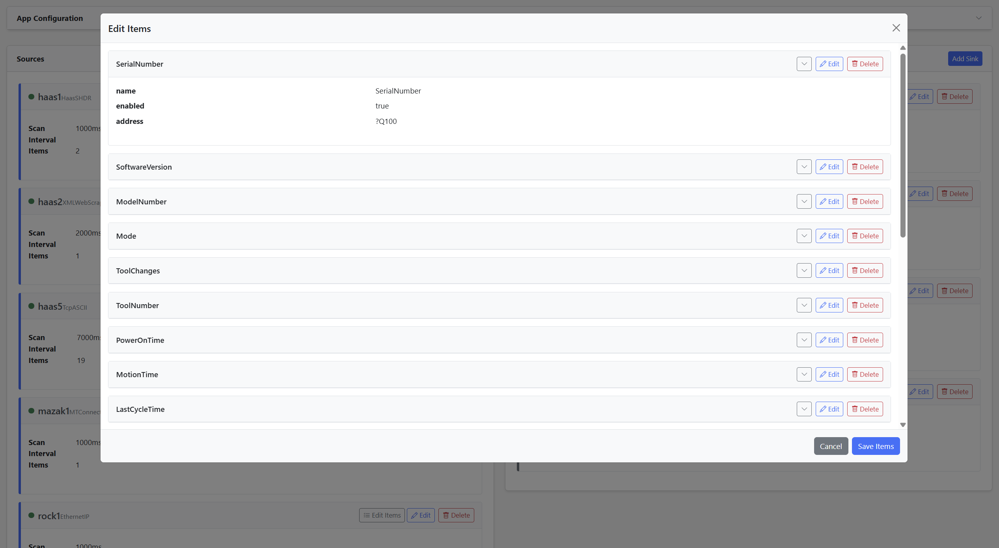

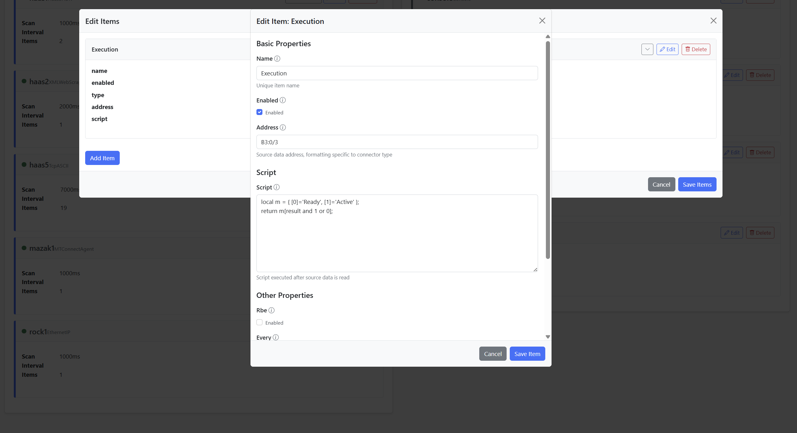

**Configuration Features:**
- Multi-connector orchestration
- Drag-and-drop interface
- Real-time validation
- Configuration versioning
- Template management

---

## Schema Validation & Data Quality

### Enterprise-Grade Data Governance

**Data Quality Assurance:**
- 📋 **Schema Validation**: Enforce data structure compliance
- 🔍 **Type Checking**: Automatic data type verification
- 🚨 **Quality Alerts**: Real-time data quality monitoring
- 📊 **Validation Reports**: Comprehensive quality metrics

---

## Comprehensive Monitoring Suite

### Multi-Level Operational Insights

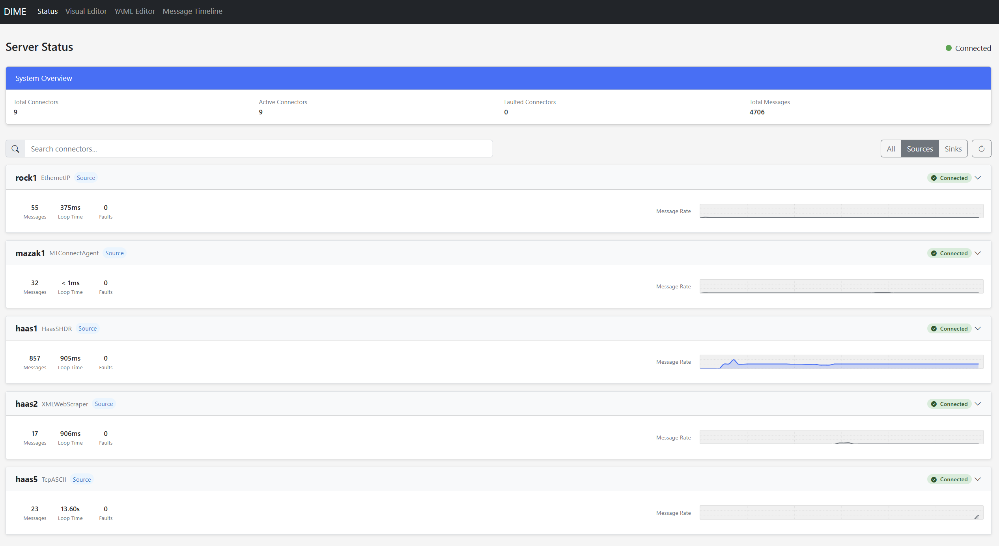

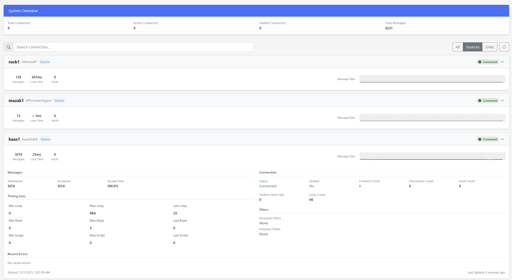

**Monitoring Capabilities:**
- System-wide health dashboard
- Connector-specific metrics
- Message flow visualization
- Performance trending
- Alert management

---

## Extended Monitoring Views

### Deep Operational Visibility

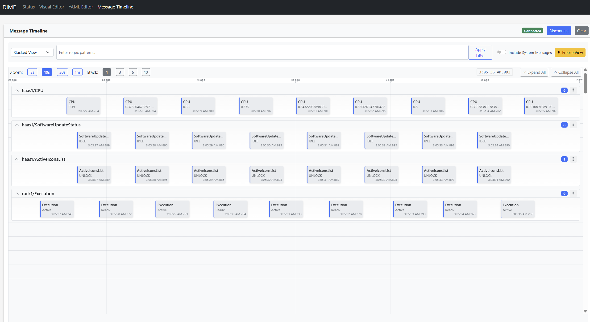

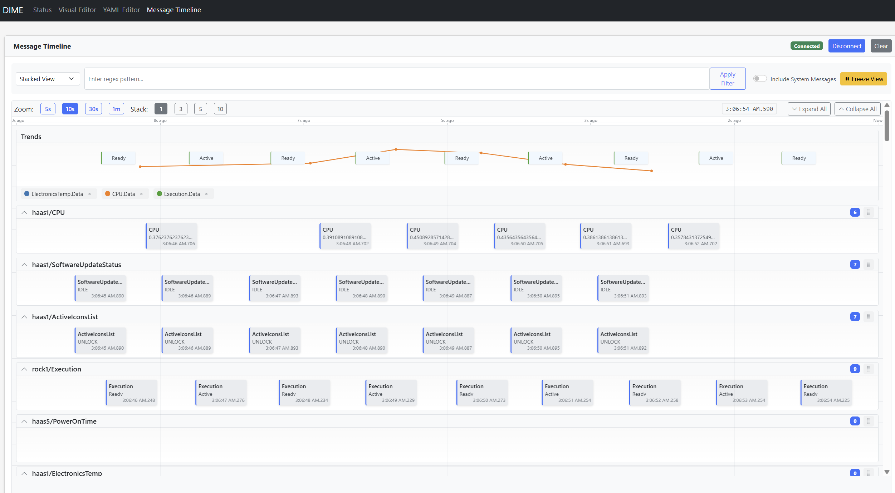

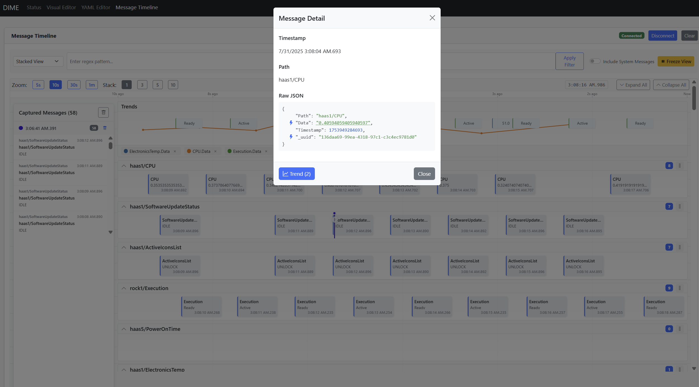

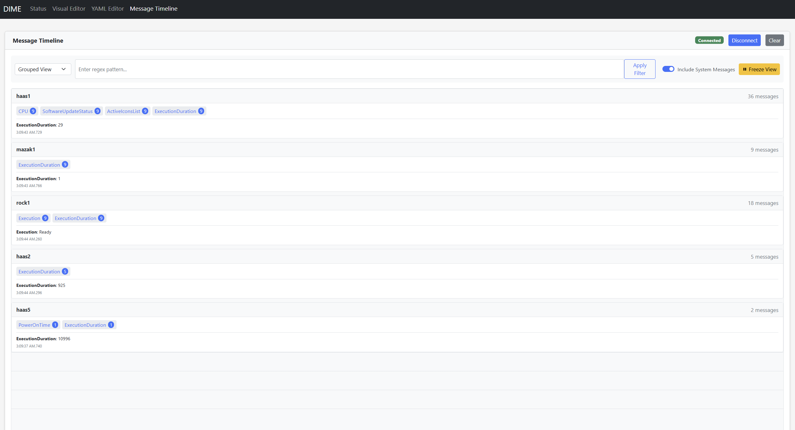

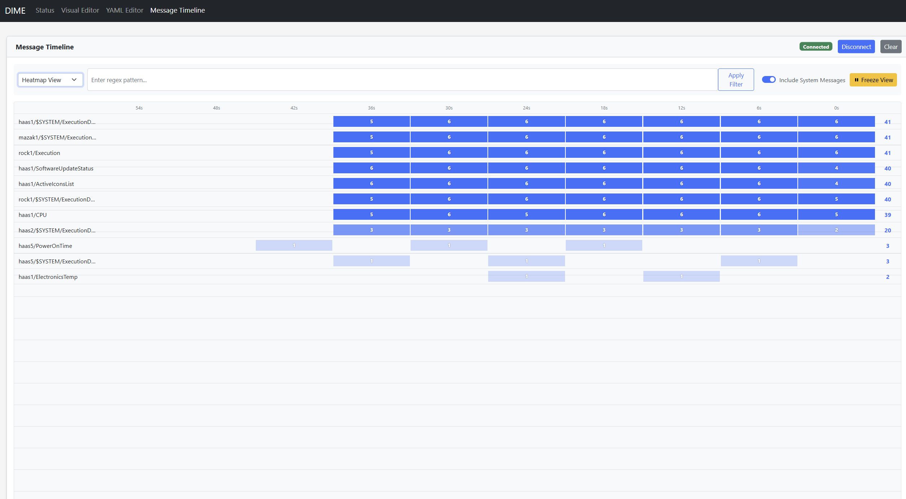

---

## AI-Powered Configuration Generation

### Multiple Configuration Scenarios

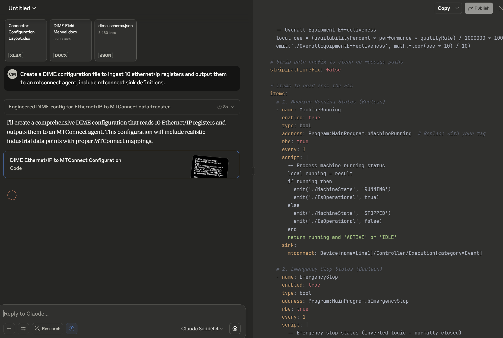

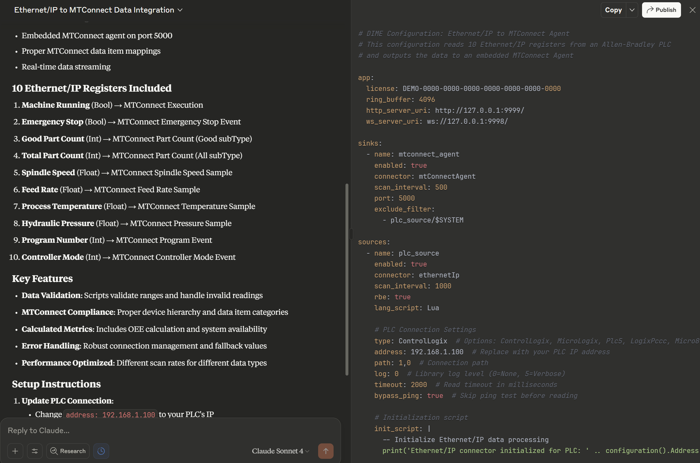

**AI Configuration Benefits:**
- Natural language requirements processing
- Best practice implementation
- Error-free configuration generation
- Rapid prototyping capability

---

## Intelligent Data Integration

### AI-Driven Integration Patterns

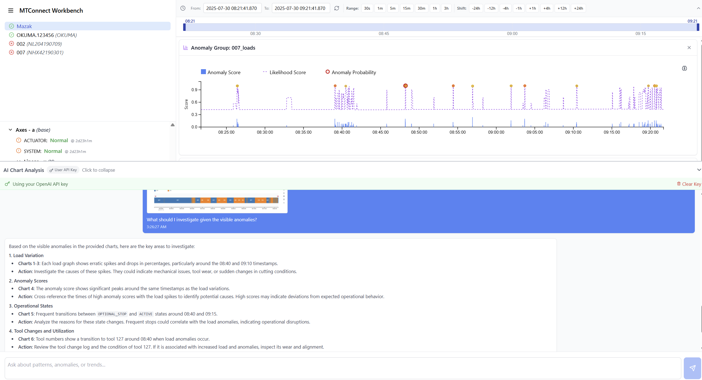

**Integration Intelligence:**
- Automatic protocol detection
- Smart data mapping
- Conflict resolution
- Performance optimization

---

## Advanced HTM Analytics

### Neuromorphic Pattern Recognition

**HTM Capabilities:**
- Sparse distributed representations
- Temporal memory processing
- Predictive state modeling
- Anomaly likelihood scoring

---

## Manufacturing Intelligence Workbench

### Comprehensive Production Analytics

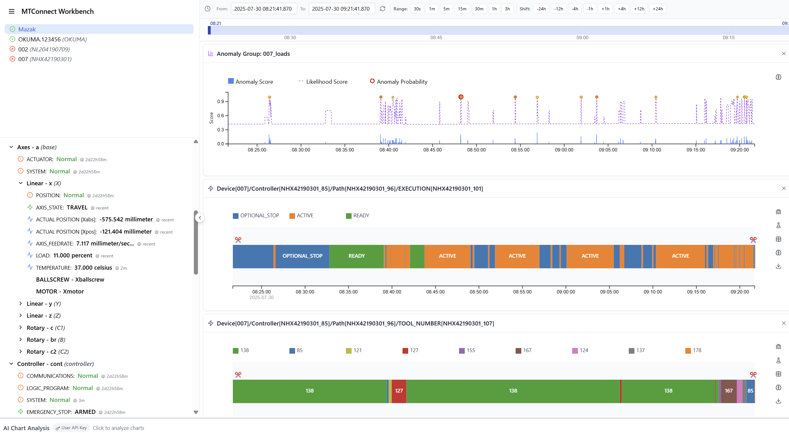

**Production Intelligence:**
- Real-time OEE calculation
- Quality trend analysis
- Predictive maintenance insights
- Production optimization recommendations

---

## Complete Industrial DataOps Platform

### End-to-End Manufacturing Intelligence

**DIME Ecosystem Components:**
1. **Data Integration Layer**: 40+ connectors for universal connectivity
2. **Processing Engine**: Disruptor-based ultra-low latency
3. **AI/ML Layer**: Neuromorphic HTM + traditional ML
4. **Analytics Platform**: Real-time visualization and insights
5. **Management Portal**: Enterprise-grade monitoring and control

---

## Transformation Capabilities

### Flexible Data Processing

**Built-in Transformation Support:**
- 🐍 **Python Scripting**: Complex data transformations
- 🌙 **Lua Scripting**: High-performance processing
- 📝 **Template Engines**: Scriban and Liquid support
- 🔄 **Real-time Processing**: Transform data in-flight

**Use Cases:**
- Data normalization and enrichment
- Unit conversions and calculations
- Custom business logic implementation
- Cross-connector data correlation

---

## Security & Compliance

### Enterprise-Ready Security

**Security Features:**
- 🔐 **Encrypted Communications**: TLS/SSL for all connections
- 🔑 **Authentication**: Multiple auth methods supported
- 👥 **Role-Based Access**: Granular permission control
- 📋 **Audit Logging**: Complete activity tracking
- 🏭 **Air-Gap Support**: Secure isolated deployments

---

## Migration & Integration Services

### Accelerated Digital Transformation

**Migration Capabilities:**
- 🔄 **Legacy System Migration**: Automated configuration translation
- 📊 **Competitive Migration**: Import from other platforms
- 🏭 **Brownfield Integration**: Connect existing infrastructure
- 🚀 **Rapid Deployment**: Days instead of months

**Supported Migrations:**
- Legacy SCADA/HMI systems
- Proprietary data collectors
- Custom integration solutions
- Competing platform configurations

---

## Business Impact & ROI

### Measurable Value Delivery

**Documented Benefits:**
- ⏱️ **70% Faster Deployment**: Days vs. months for integration
- 💰 **60% Cost Reduction**: Eliminated custom development
- 📈 **25% OEE Improvement**: Real-time visibility and analytics
- 🔧 **50% Less Downtime**: Predictive maintenance with HTM
- 🚀 **10x Faster Time-to-Value**: AI-generated solutions

---

## Industry Applications

### Proven Across Manufacturing Sectors

**Automotive Manufacturing**
- Assembly line monitoring
- Quality control integration
- Supply chain visibility

**Discrete Manufacturing**
- CNC machine monitoring
- Production scheduling optimization
- Tool life management

**Process Industries**
- Real-time process control
- Quality assurance
- Regulatory compliance

**Energy & Utilities**
- Asset performance monitoring
- Predictive maintenance
- Grid optimization

---

## Partner Ecosystem

### Comprehensive Technology Integration

**Technology Partners:**
- Cloud providers (AWS, Azure, GCP)
- Database vendors
- Analytics platforms
- ERP/MES systems

**Solution Partners:**
- System integrators
- Industry consultants
- Value-added resellers
- Technology providers

---

## Support & Services

### Complete Customer Success

**Available Services:**
- 🎓 **Training Programs**: Operator to architect certification
- 👥 **Professional Services**: Implementation and optimization
- 🔧 **Technical Support**: 24/7 enterprise support available
- 📚 **Documentation**: Comprehensive guides and tutorials
- 🤝 **Community**: Active user community and forums

---

## Roadmap & Innovation

### Continuous Platform Evolution

**Coming Soon:**
- Enhanced AI/ML model library
- Expanded protocol support
- Advanced analytics capabilities
- Edge computing optimizations
- Industry-specific solutions

**Innovation Commitment:**
- Quarterly feature releases
- Community-driven development
- Open architecture evolution
- Emerging technology adoption

---

## Why DIME?

### The Clear Choice for Industrial Data Integration

✅ **Most Comprehensive Protocol Support** - 40+ connectors out of the box
✅ **Revolutionary AI Capabilities** - Neuromorphic HTM + AI configuration
✅ **Fastest Time-to-Value** - Deploy in days, not months
✅ **Flexible Deployment** - Cloud, on-premises, edge, or hybrid
✅ **Enterprise-Grade** - Proven in Fortune 500 deployments
✅ **Future-Proof** - Continuous learning and adaptation

---

## Next Steps

### Begin Your Digital Transformation Journey

1. **Technical Evaluation**: Architecture review and requirements analysis
2. **Proof of Concept**: AI-generated solution for your use case
3. **Pilot Deployment**: Production trial with selected equipment
4. **Full Rollout**: Enterprise-wide deployment and optimization

**Contact us today to see DIME in action with your data**

---

## Appendix: Technical Specifications

### Platform Requirements
- **OS Support**: Windows, Linux, Docker
- **Hardware**: 4+ cores, 8GB+ RAM recommended
- **Network**: Ethernet, WiFi, Cellular supported
- **Protocols**: TCP/IP, UDP, Serial, OPC, MQTT, HTTP/S

### Performance Specifications
- **Throughput**: 1M+ messages/second
- **Latency**: <1ms end-to-end
- **Connectors**: Unlimited concurrent
- **Scalability**: Horizontal and vertical

### Integration Options
- **APIs**: REST, GraphQL, WebSocket
- **SDKs**: .NET, Python, Node.js
- **Formats**: JSON, XML, CSV, Parquet
- **Standards**: OPC-UA, MQTT, MTConnect

---

*DIME - Transforming Industrial Data into Competitive Advantage*